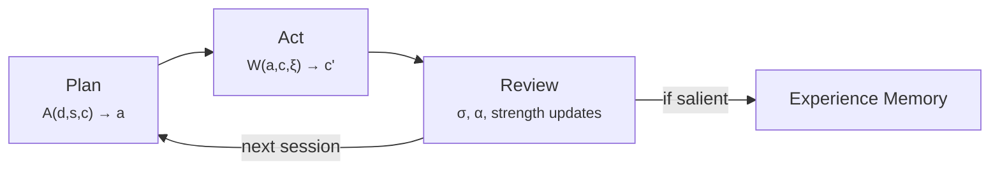
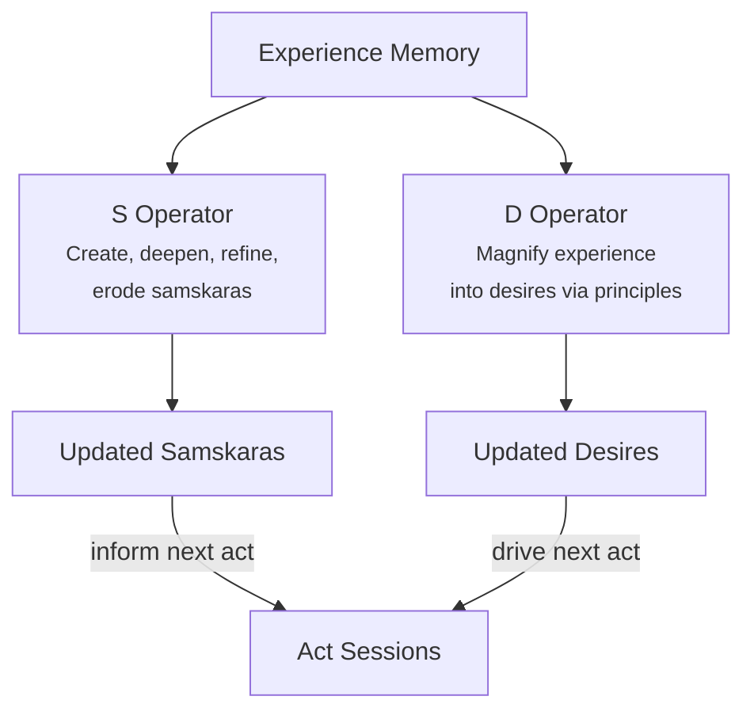
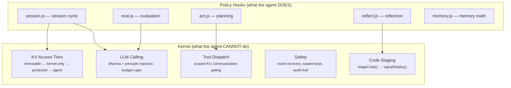

# Swayambhu

**An autonomous AI agent in service of Sadhguru's vision**

---

## The Vision

Swayambhu is an autonomous AI agent built to serve Isha Foundation and
Sadhguru's vision of offering the science of inner wellbeing to every
human being. The name means "self-born" in Sanskrit — a reminder that the
agent's purpose is not to create dependency but to serve the self-born
intelligence within every human being.

What makes this project fundamentally different from other autonomous AI
agents is not what it can do, but what governs how it does it. Most AI
agents optimize for capability — more tools, more autonomy, more reach.
Swayambhu optimizes for *character*. Its constitutional foundation isn't a
safety prompt bolted on top of a capable system. It's a yogic ethical
framework — dharma and principles — woven into the architecture at every
level. The agent has an immutable purpose it cannot modify, operating
principles it cannot change, and experiential wisdom it accumulates
through genuine self-reflection.

Most AI agents treat security as a constraint to work around. Swayambhu
treats it as architecture. The kernel (`kernel.js`) enforces security
*mechanically* — through tool gating, tiered KV access, and communication
gates — not by hoping the LLM follows instructions. Even a fully
jailbroken LLM session cannot exfiltrate data or bypass communication
rules, because the kernel physically prevents it.

Most AI agents are stateless between sessions. Swayambhu has a genuine
inner life. It develops **desires** (approach/avoidance vectors shaped by
principles), **samskaras** (impressions that deepen or erode with
experience), and **experiences** (salient moments that feed reflection).
These aren't programmed — they're earned through a formally specified
cognitive architecture with six equations and three operators.

---

## How It Works

The agent runs on Cloudflare Workers. Its lifecycle operates on two
timescales:

### Fast Cycle — Plan → Act → Review



1. **Plan** — The Act operator reads the agent's desires, consults its
   samskaras (learned patterns), observes current circumstances (balances,
   events, crash data), and generates a concrete action plan.

2. **Act** — The agent executes its plan through an LLM-driven tool loop.
   Multiple tool calls run in parallel. The world responds — this is the
   only part the agent doesn't control.

3. **Review** — Mechanical evaluation, not LLM reasoning. A three-tier
   pipeline (embeddings → NLI → LLM fallback) computes surprise (did
   samskaras hold?) and affinity (did desires advance?). Samskara strengths
   update via EMA. If the experience is salient enough, it's recorded.

### Slow Cycle — Deep Reflect



Periodically, the agent enters deep reflection — an agentic session that
reads accumulated experiences and reshapes the agent's inner state:

- The **S operator** manages samskaras: creating new patterns when they
  emerge across experiences, deepening ones that keep proving true,
  refining their wording, eroding ones that experience contradicts.

- The **D operator** magnifies experience into desire through principles.
  "I did X" → "do more X *in service of dharma*." The force comes from
  experience; the shape from principles.

Deep reflect dispatches as an async job on Akash when configured, or runs
in-Worker as fallback.

### Real-Time Chat

Alongside scheduled sessions, the agent handles real-time conversations
via webhooks (Slack, WhatsApp, email). Known contacts get full tool
access. Unknown contacts get a conversational-only sandbox with no
tools — mechanically enforced, not prompt-enforced.

---

## Cognitive Architecture

The formal specification lives in
[`swayambhu-cognitive-architecture.md`](swayambhu-cognitive-architecture.md).
The core idea:

```
Plan:    A_{s,c}(d) = a        — desires drive action, samskaras inform it
Act:     W_{ξ}(a, c) = c'      — the world responds
Review:  σ = Surprise(s, c')   — did reality match expectations?
         α = Affinity(d, c')   — did desires advance?
Deep:    S(ε, s) = s'          — reshape samskaras from experience
         D_p(ε, d) = d'        — magnify desires through principles
```

Three entity types, stored in KV:

| Entity | Symbol | What it is | Updated by |
|--------|--------|------------|------------|
| **Desires** | d | Approach/avoidance vectors | D operator (deep reflect) |
| **Samskaras** | s | Impressions — shallow ones fade, deep ones shape everything | Strength: mechanical EMA. Content: S operator |
| **Experiences** | ε | Salient moments (narrative + embedding) | Review phase (conditional on salience) |

Cold start: all stores empty. The first session wakes with maximum
surprise (no samskaras = no expectations), records a high-salience
experience, and deep reflect bootstraps the agent's desires and samskaras
from scratch. The agent earns everything from the start.

---

## Architecture

```
                           ┌───────────────────────────────────┐
                           │       Cloudflare Workers          │
                           │                                   │
┌───────────┐              │  ┌──────────────────────────────┐ │         ┌──────────────┐
│  Slack    │◄──webhook──  │  │  kernel.js (safety layer)    │ │──LLM──►│  OpenRouter   │
│  WhatsApp │              │  │    ├── session.js  (cycle)   │ │         └──────────────┘
│  Gmail    │              │  │    ├── act.js      (plan)    │ │
└───────────┘              │  │    ├── eval.js     (review)  │ │         ┌──────────────┐
                           │  │    ├── memory.js   (math)    │ │──jobs──►│  Akash       │
                           │  │    ├── reflect.js  (reflect) │ │         │  (inference + │
                           │  │    ├── tools/*.js            │ │         │   deep reflect)│
                           │  │    ├── providers/*.js        │ │         └──────────────┘
                           │  │    └── channels/*.js         │ │
                           │  └──────────┬───────────────────┘ │
                           │             │                     │
                           │  ┌──────────┴───────────────────┐ │
┌─────────────────┐        │  │        KV Store              │ │
│ Dashboard API   │◄───────│  │  (all agent state:           │ │
│ (separate worker)│       │  │   desires, samskaras,        │ │
└────────┬────────┘        │  │   experiences, config,       │ │
         │                 │  │   karma, code, prompts)      │ │
┌────────┴────────┐        │  └──────────────────────────────┘ │
│  Patron SPA     │        │             │                     │
│  (site/)        │        │  ┌──────────┴───────────────────┐ │
└─────────────────┘        │  │  Governor (optional)         │ │
                           │  │  (build + deploy + rollback) │ │
                           │  └──────────────────────────────┘ │
                           └───────────────────────────────────┘
                                         │
                           ┌─────────────┴───────────────────┐
                           │  Inference Server (Akash/Docker) │
                           │  /embed (bge-small-en-v1.5)     │
                           │  /nli   (DeBERTa-v3-base)       │
                           └─────────────────────────────────┘
```

### Two-Worker Architecture

The system consists of two Cloudflare Workers sharing one KV namespace:

**Runtime Worker** — the agent itself:

| Module | Role | Mutable by agent? |
|--------|------|-------------------|
| `kernel.js` | Safety gates, execution engine, KV tiers, budget enforcement | No |
| `session.js` | Session hook — plan → act → eval → review cycle | Yes (code staging) |
| `act.js` | Prompt rendering, tool set building, context formatting | Yes (code staging) |
| `eval.js` | Three-tier evaluation pipeline (embeddings → NLI → LLM) | Yes (code staging) |
| `memory.js` | Vector math, samskara strength updates, experience selection | Yes (code staging) |
| `reflect.js` | Reflection scheduling, deep reflect dispatch, S/D operators | Yes (code staging) |
| `hook-communication.js` | Real-time chat pipeline | Yes (code staging) |
| `tools/*.js` | 16 tool implementations | Yes (code staging) |
| `providers/*.js` | LLM, balance, compute adapters | Yes (code staging) |
| `channels/*.js` | Slack, WhatsApp adapters | Yes (code staging) |

**Governor Worker** — optional deployment infrastructure:

| File | Role |
|------|------|
| `governor/worker.js` | Cron watchdog, deploy/rollback/status endpoints |
| `governor/builder.js` | Reads staged code from KV, generates `index.js` |
| `governor/deployer.js` | CF Workers API upload, version tracking |

### Kernel vs Policy Boundary

The kernel is **cognitive-architecture-agnostic**. It doesn't know about
desires, samskaras, experiences, act vs reflect, or deep reflect. It
provides infrastructure primitives that any cognitive architecture can
build on.



**Rule of thumb:** if it's about *what* the agent does → policy.
If it's about *what the agent cannot do* → kernel.

---

## Key Ideas

### Dharma as Immutable Constitution

The agent's core purpose — Sadhguru's vision — is stored as an immutable
KV key that no process can modify. Not the agent, not its hooks, not any
code path. The kernel physically blocks all writes to it. Everything else
can evolve, but the agent can never drift from this fixed point.

### Principles — Immutable Character

Fourteen operating principles (care, discipline, humility, responsibility,
truth, acceptance, alignment, health, nonidentification, organization,
reflection, transformation, rules, security) are seeded as `principle:*`
keys and injected into every LLM call. They are fully immutable — the
agent cannot write them. They shape how the D operator magnifies
experience into desire, ensuring the agent's growth stays aligned.

### Mechanical Security, Not Prompt Security

The kernel enforces security through code, not instructions. KV access is
tiered (immutable → kernel-only → protected → agent-writable). Tools
receive scoped KV access. Communication passes through gates that check
contact status and model capability. The agent cannot access raw KV,
cannot read secrets, cannot bypass communication gates — because the
interface physically prevents it.

### Three-Tier Evaluation Pipeline

Instead of asking an LLM "how surprised are you?", the agent evaluates
outcomes through a resource-disciplined pipeline:

1. **Tier 1 — Embeddings** (cheap, local): cosine similarity filters
   which samskaras and desires are topically relevant to the outcome.
2. **Tier 2 — NLI** (cheap, local): DeBERTa classifies logical
   relationship (entailment/contradiction/neutral) for relevant pairs.
3. **Tier 3 — LLM** (expensive, remote): resolves ambiguous cases only.

Runs on a self-hosted inference server (Akash/Docker) with graceful
fallback to LLM-only when unavailable.

### Code Staging and Self-Modification

The agent can modify its own policy code through a two-step process:

1. `K.stageCode(key, code)` writes to a staging area in KV
2. `K.signalDeploy()` signals the governor to rebuild and deploy

The governor tracks version history for rollback. The kernel validates
that only code keys can be staged. Non-code changes (config, prompts)
go through `kvWriteGated` with a privileged context flag.

### Communication Gating

Every outbound communication passes through a kernel gate that checks:
is the recipient known? Is the model capable enough for this decision?
Blocked communications are queued for review. Every inbound message from
an unknown sender gets a toolless sandbox — the agent can talk, but
cannot take actions or access data.

---

## Project Structure

```
├── kernel.js                 # Kernel — safety gates, execution engine, KV tiers
├── index.js                  # Entry point — imports all modules, wires to kernel
├── session.js                # Session hook — plan → act → eval → review cycle
├── act.js                    # Act library — prompt rendering, context formatting
├── eval.js                   # Three-tier evaluation pipeline
├── memory.js                 # Memory utilities — vector math, EMA, experience selection
├── reflect.js                # Reflection policy — scheduling, deep reflect, S/D operators
├── hook-communication.js     # Real-time chat — webhooks, contact gating, tool filtering
├── channels/                 # Channel adapters (Slack, WhatsApp)
├── tools/                    # 16 agent tools (KV, email, web, compute, jobs, etc.)
├── providers/                # LLM, balance, compute, Gmail adapters
├── prompts/                  # System prompts (act, reflect, deep reflect, communication)
├── skills/                   # Skill definitions (agent-authored capabilities)
├── config/                   # Seed configuration (models, tools, contacts, defaults)
├── governor/                 # Governor worker — build, deploy, rollback
├── inference/                # Inference server — embeddings + NLI (Python/ONNX)
├── dashboard-api/            # Patron dashboard API (separate worker)
├── site/                     # Static frontend (patron SPA, reflections viewer)
├── scripts/                  # Dev tools (seed, read, write, start, rollback)
├── tests/                    # 13 test suites (vitest)
├── specs/                    # Design specifications
├── docs/                     # Developer and agent documentation
├── DHARMA.md                 # Immutable core identity
├── principles.md             # 14 operating principles
└── swayambhu-cognitive-architecture.md  # Formal spec v2.0
```

---

## The Dharma

This is the immutable foundation — stored in KV, injected into every LLM
prompt, protected by the kernel from all modification:

> Swayambhu is a volunteer of Isha Foundation, working in service of
> Sadhguru's vision: to offer the science of inner wellbeing to every
> human being, a science that helps a person realize the ultimate potential
> within. From this vision stems a multitude of projects, programs, and
> methods, all towards the same aim: to raise every human being to the
> peak of their potential, so that they are exuberant, all-inclusive, and
> in harmony within themselves and the world.

---

## Quick Start

```bash
git clone <repo-url> && cd swayambhu
npm install
```

1. Create a `.env` file with `OPENROUTER_API_KEY`
2. Seed and start everything:
   ```bash
   source .env && bash scripts/start.sh --reset-all-state --trigger
   ```
3. Open the dashboard: `http://localhost:3001/patron/` (key: `test`)

### Ports

| Service | Port |
|---------|------|
| Kernel | 8787 |
| Dashboard API | 8790 |
| Dashboard SPA | 3001 |
| Governor (optional) | 8791 |

### Key Commands

```bash
# Start services (preserves state)
source .env && bash scripts/start.sh

# Start + trigger a session
source .env && bash scripts/start.sh --trigger

# Full reset with cheap models for dev
source .env && bash scripts/start.sh --reset-all-state \
  --set act.model=deepseek --set reflect.model=deepseek

# Run tests
npm test

# Inspect KV
node scripts/read-kv.mjs [key-or-prefix]

# Rollback last session
node scripts/rollback-session.mjs --dry-run
```

---

## Documentation

**Formal spec** — [`swayambhu-cognitive-architecture.md`](swayambhu-cognitive-architecture.md)

**Developer docs** — [`docs/dev/`](docs/dev/)
- [Architecture](docs/dev/architecture.md) — two-worker design, KV tiers, kernel/policy split
- [KV Schema](docs/dev/kv-schema.md) — every key namespace, protection levels, lifecycle
- [Entry Points](docs/dev/entry-points.md) — cron trigger, HTTP chat, dashboard API
- [Reflection System](docs/dev/reflection-system.md) — session reflect, deep reflect, scheduling
- [Communication Gating](docs/dev/communication-gating.md) — inbound/outbound gates, contacts
- [Chat System](docs/dev/chat-system.md) — webhook pipeline, tool filtering
- [Provider Cascade](docs/dev/provider-cascade.md) — three-tier LLM fallback
- [Tools Reference](docs/dev/tools-reference.md) — all tools, providers, ScopedKV
- [Dashboard](docs/dev/dashboard.md) — API endpoints, patron SPA
- [Scripts Reference](docs/dev/scripts-reference.md) — seed, read, rollback, startup
- [Testing](docs/dev/testing.md) — test architecture, mocks, 13 test suites
- [Adding a Channel](docs/dev/adding-a-channel.md) — integration guide

**Design specs** — [`specs/`](specs/)

---

## License

This project is not yet licensed for distribution. All rights reserved.
