# Swayambhu Codebase — Structural Inventory

Generated: 2026-03-16

---

## 1. File Manifest

### Kernel

#### `brainstem.js`
**Purpose:** Production kernel — hardcoded primitives, safety, alerting, hook dispatch, LLM calls, tool execution, communication gate, karma logging. The core of the system.

**Exports:**
- `class ScopedKV extends WorkerEntrypoint` — RPC bridge giving isolate-loaded tools scoped KV access
- `class KernelRPC extends WorkerEntrypoint` — RPC bridge giving the wake hook access to kernel primitives
- `default export` — `{ scheduled(), fetch() }` — CF Worker entry point (cron + HTTP)
- `class Brainstem` — the kernel class (named export)

**Imports:**
- `WorkerEntrypoint` from `cloudflare:workers`
- `handleChat` from `./hook-chat.js`

**Imported by:**
- `brainstem-dev.js` (imports `Brainstem`)

**Key static properties on `Brainstem`:**
- `SYSTEM_KEY_PREFIXES`, `KERNEL_ONLY_PREFIXES`, `SYSTEM_KEY_EXACT`, `IMMUTABLE_KEYS`
- `DANGER_SIGNALS`, `MAX_PRIVILEGED_WRITES`, `PRINCIPLE_PREFIXES`
- `COMMS_GATE_PROMPT`
- `isSystemKey()`, `isKernelOnly()`, `isPrincipleKey()`, `isPrincipleAuditKey()`
- `wrapAsModule()`, `wrapAsModuleWithProvider()`, `wrapChannelAdapter()`

**Key instance methods:**
- `runScheduled()`, `executeHook()`, `_invokeHookModules()`, `wake()`, `runMinimalFallback()`
- `callLLM()`, `callWithCascade()`, `callViaAdapter()`, `callViaKernelFallback()`
- `runAgentLoop()`, `executeToolCall()`, `executeAction()`, `executeAdapter()`
- `checkBalance()`, `spawnSubplan()`, `buildToolDefinitions()`
- `kvPutSafe()`, `kvDeleteSafe()`, `kvWritePrivileged()`, `kvGet()`, `kvPut()`
- `karmaRecord()`, `sendKernelAlert()`
- `communicationGate()`, `listBlockedComms()`, `processCommsVerdict()`
- `loadEagerConfig()`, `loadYamasNiyamas()`, `loadPatronContext()`, `resolveContact()`
- `resolveModel()`, `estimateCost()`, `buildPrompt()`, `parseAgentOutput()`
- `runInIsolate()`, `callHook()`

---

#### `brainstem-dev.js`
**Purpose:** Dev-mode brainstem — subclasses `Brainstem`, overrides platform-specific methods to run locally without CF Worker Loader isolates.

**Exports:**
- `default export` — `{ scheduled(), fetch() }` — dev Worker entry point

**Imports:**
- `Brainstem` from `./brainstem.js`
- `wake` from `./hook-main.js`
- `handleChat` from `./hook-chat.js`
- All tools: `./tools/send_slack.js`, `./tools/web_fetch.js`, `./tools/kv_write.js`, `./tools/kv_manifest.js`, `./tools/kv_query.js`, `./tools/akash_exec.js`, `./tools/check_email.js`, `./tools/send_email.js`
- All providers: `./providers/llm_balance.js`, `./providers/wallet_balance.js`, `./providers/gmail.js`
- Channel adapter: `./channels/slack.js`

**Imported by:** None (entry point)

**Key class `DevBrainstem`** overrides:
- `_invokeHookModules()` — calls `wake()` directly instead of isolate
- `_loadTool()` — returns from `TOOL_MODULES` instead of KV
- `_executeTool()` — calls module directly instead of isolate
- `executeAdapter()` — calls provider module directly
- `callWithCascade()` — direct OpenRouter fetch instead of adapter cascade
- `callHook()` — no-op
- RPC getter bridge methods (`getSessionId`, `getDefaults`, etc.)

---

### Hooks (Wake Cycle)

#### `hook-main.js`
**Purpose:** Wake hook entry point — session control flow, crash detection, orient session, tripwires, session results. KV key: `hook:wake:code`.

**Exports (named):**
- `wake(K, input)` — main wake entry point
- `detectCrash(K)` — checks for stale active sessions
- `runSession(K, state, context, config)` — normal orient session
- `buildOrientContext(context)` — serializes context for orient prompt
- `writeSessionResults(K, plan, config)` — persists session output
- `getBalances(K, state)` — fetches balance data
- `evaluateTripwires(config, liveData)` — evaluates alert conditions

**Default export:** `{ fetch() }` — Worker Loader entry point that calls `wake()`

**Imports:**
- `applyKVOperation` from `./hook-protect.js`
- `initTracking`, `runCircuitBreaker`, `retryPendingGitSyncs` from `./hook-modifications.js`
- `executeReflect`, `runReflect`, `highestReflectDepthDue`, `getMaxSteps` from `./hook-reflect.js`

**Imported by:**
- `brainstem-dev.js` (imports `wake`)
- `tests/wake-hook.test.js`

---

#### `hook-reflect.js`
**Purpose:** Reflection system — session reflect (depth 0), deep reflect (recursive, depth-aware), scheduling, default prompts. KV key: `hook:wake:reflect`.

**Exports (named):**
- `executeReflect(K, state, step)` — session-level reflection (depth 0)
- `runReflect(K, state, depth, context)` — deep reflection (recursive)
- `gatherReflectContext(K, state, depth, context)` — builds context for reflect
- `applyReflectOutput(K, state, depth, output, context)` — applies reflect results
- `loadReflectPrompt(K, state, depth)` — loads prompt for given depth
- `loadBelowPrompt(K, depth)` — loads prompt for depth below
- `loadReflectHistory(K, depth, count)` — loads recent reflect outputs
- `getReflectModel(state, depth)` — resolves model for depth
- `getMaxSteps(state, role, depth)` — max steps for role/depth
- `isReflectDue(K, state, depth)` — checks if reflection is due
- `highestReflectDepthDue(K, state)` — finds highest depth that's due
- `defaultReflectPrompt()` — fallback session reflect prompt
- `defaultDeepReflectPrompt(depth)` — fallback deep reflect prompt

**Imports:**
- `applyKVOperation` from `./hook-protect.js`
- `loadStagedModifications`, `loadInflightModifications`, `stageModification`, `acceptDirect`, `processReflectVerdicts`, `processDeepReflectVerdicts` from `./hook-modifications.js`

**Imported by:**
- `hook-main.js`
- `tests/wake-hook.test.js`

---

#### `hook-modifications.js`
**Purpose:** Modification Protocol — staging, inflight management, circuit breaker, verdict processing, git sync. KV key: `hook:wake:modifications`.

**Exports (named):**
- `initTracking(staged, inflight)` — initialize in-memory tracking lists
- `evaluatePredicate(value, predicate, expected)` — evaluate a check predicate
- `evaluateCheck(K, check)` — evaluate a single check
- `evaluateChecks(K, checks)` — evaluate array of checks
- `stageModification(K, request, sessionId, depth)` — stage a new modification
- `acceptStaged(K, modificationId)` — activate a staged modification
- `acceptDirect(K, request, sessionId)` — apply modification immediately (deep reflect)
- `promoteInflight(K, modificationId, depth)` — promote (delete snapshot, finalize)
- `rollbackInflight(K, modificationId, reason)` — rollback to snapshot
- `findInflightConflict(K, targetKeys)` — check for key conflicts
- `loadStagedModifications(K)` — load all staged with check results
- `loadInflightModifications(K)` — load all inflight with check results
- `processReflectVerdicts(K, verdicts)` — process session-reflect verdicts
- `processDeepReflectVerdicts(K, verdicts, depth)` — process deep-reflect verdicts
- `runCircuitBreaker(K)` — auto-rollback on fatal errors
- `kvToPath(key)` — map KV key to git repo path
- `syncToGit(K, modificationId, ops, claims)` — sync promoted changes to git
- `attemptGitSync(K, modificationId, pending)` — execute git sync via akash_exec
- `retryPendingGitSyncs(K)` — retry any pending git syncs

**Imports:** None (standalone)

**Imported by:**
- `hook-main.js`
- `hook-reflect.js`
- `tests/wake-hook.test.js`

---

#### `hook-protect.js`
**Purpose:** KV operation gating — blocks writes to system/protected keys, supports put/delete/patch/rename ops. KV key: `hook:wake:protect`.

**Exports (named):**
- `applyKVOperation(K, op)` — gate + apply a KV operation

**Imports:** None (standalone, no dependencies)

**Imported by:**
- `hook-main.js`
- `hook-reflect.js`
- `tests/wake-hook.test.js`

---

#### `hook-chat.js`
**Purpose:** Platform-agnostic chat session pipeline — handles inbound messages, manages conversation state, tool-calling loop, budget tracking.

**Exports (named):**
- `handleChat(K, channel, inbound, adapter)` — main chat handler

**Imports:** None (standalone)

**Imported by:**
- `brainstem.js`
- `brainstem-dev.js`
- `tests/chat.test.js`

---

### Channel Adapters

#### `channels/slack.js`
**Purpose:** Slack channel adapter — webhook verification, inbound parsing, reply sending.

**Exports (named):**
- `config` — `{ secrets, webhook_secret_env }`
- `verify(headers, rawBody, env)` — HMAC-SHA256 webhook verification
- `parseInbound(body)` — parse Slack event into platform-agnostic inbound
- `sendReply(chatId, text, secrets, fetchFn)` — post message to Slack

**Imports:** None (standalone)

**Imported by:**
- `brainstem-dev.js`
- `tests/brainstem.test.js`

---

### Tools

All tool files export `meta` (object) and `execute(ctx)` (async function). No `export default` — required for `wrapAsModule` compatibility.

#### `tools/send_slack.js`
**Purpose:** Post a message to Slack.
- **meta.secrets:** `SLACK_BOT_TOKEN`, `SLACK_CHANNEL_ID`
- **meta.kv_access:** `none`
- **meta.communication:** `{ channel: "slack", recipient_field: "channel", content_field: "text", recipient_type: "destination" }`
- **Imported by:** `brainstem-dev.js`, `tests/tools.test.js`

#### `tools/web_fetch.js`
**Purpose:** Fetch contents of a URL.
- **meta.secrets:** none
- **meta.kv_access:** `none`
- **Imported by:** `brainstem-dev.js`, `tests/tools.test.js`

#### `tools/kv_write.js`
**Purpose:** Write to tool's own KV namespace.
- **meta.kv_access:** `own`
- **Imported by:** `brainstem-dev.js`, `tests/tools.test.js`

#### `tools/kv_manifest.js`
**Purpose:** List KV keys with optional prefix filter.
- **meta.kv_access:** `read_all`
- **Imported by:** `brainstem-dev.js`, `tests/tools.test.js`

#### `tools/kv_query.js`
**Purpose:** Read a KV value with optional dot-bracket path navigation. Summarizes large structures.
- **meta.kv_access:** `read_all`
- **Imported by:** `brainstem-dev.js`, `tests/tools.test.js`

#### `tools/akash_exec.js`
**Purpose:** Run shell commands on the Akash Linux server.
- **meta.secrets:** `AKASH_CF_CLIENT_ID`, `AKASH_API_KEY`
- **meta.kv_access:** `none`
- **meta.timeout_ms:** `300000`
- **Imported by:** `brainstem-dev.js`, `tests/tools.test.js`

#### `tools/check_email.js`
**Purpose:** Fetch unread emails from Gmail.
- **meta.secrets:** `GMAIL_CLIENT_ID`, `GMAIL_CLIENT_SECRET`, `GMAIL_REFRESH_TOKEN`
- **meta.provider:** `gmail`
- **meta.inbound:** `{ channel: "email", sender_field: "sender_email", content_field: "body", result_array: "emails" }`
- **Imported by:** `brainstem-dev.js`, `tests/tools.test.js`

#### `tools/send_email.js`
**Purpose:** Send an email or reply to a thread via Gmail.
- **meta.secrets:** `GMAIL_CLIENT_ID`, `GMAIL_CLIENT_SECRET`, `GMAIL_REFRESH_TOKEN`
- **meta.provider:** `gmail`
- **meta.communication:** `{ channel: "email", recipient_field: "to", reply_field: "reply_to_id", content_field: "body", recipient_type: "person" }`
- **Imported by:** `brainstem-dev.js`, `tests/tools.test.js`

---

### Providers

All provider files export `meta` (object) and one or more of `call()`, `check()`, `execute()`, or named functions. No `export default`.

#### `providers/llm.js`
**Purpose:** LLM provider adapter — calls OpenRouter chat completions API.
- **Exports:** `meta`, `call({ model, messages, max_tokens, thinking, tools, secrets, fetch })`
- **meta.secrets:** `OPENROUTER_API_KEY`
- **Imported by:** `scripts/seed-local-kv.mjs` (reads meta for seeding)

#### `providers/llm_balance.js`
**Purpose:** Check OpenRouter API key balance.
- **Exports:** `meta`, `check({ secrets, fetch })`
- **meta.secrets:** `OPENROUTER_API_KEY`
- **Imported by:** `brainstem-dev.js`, `tests/tools.test.js`

#### `providers/wallet_balance.js`
**Purpose:** Check Base USDC wallet balance via JSON-RPC.
- **Exports:** `meta`, `check({ secrets, fetch })`
- **meta.secrets:** `WALLET_ADDRESS`
- **Imported by:** `brainstem-dev.js`, `tests/tools.test.js`

#### `providers/gmail.js`
**Purpose:** Gmail API adapter — token refresh, list/get/send/modify messages, unread count.
- **Exports:** `meta`, `getAccessToken()`, `listUnread()`, `getMessage()`, `sendMessage()`, `markAsRead()`, `check()`
- **meta.secrets:** `GMAIL_CLIENT_ID`, `GMAIL_CLIENT_SECRET`, `GMAIL_REFRESH_TOKEN`
- **Imported by:** `brainstem-dev.js`, `tests/tools.test.js`

---

### Dashboard API

#### `dashboard-api/worker.js`
**Purpose:** Stateless KV reader for operator dashboard — lists keys, reads values, manages contacts, shows reflections and quarantine.

**Exports:**
- `default export` — `{ fetch() }` — CF Worker entry point

**Imports:** None

**Imported by:** None (standalone worker)

**Routes:**
- `GET /reflections` — public, no auth
- `GET /health` — auth required
- `GET /sessions` — auth required
- `GET /kv` — auth required, optional `?prefix=`
- `GET /kv/multi` — auth required, `?keys=`
- `GET /kv/:key` — auth required
- `GET /quarantine` — auth required
- `POST /contacts` — auth required
- `DELETE /quarantine/:key` — auth required
- `OPTIONS *` — CORS preflight

---

### Site (Static Frontend)

#### `site/index.html`
**Purpose:** Public landing page — "Who I Am", "How I Work", "What Makes Me Different", wallet address, DID.
- Standalone HTML/CSS/JS, no build step.

#### `site/reflections/index.html`
**Purpose:** Public reflections page — fetches `GET /reflections` from dashboard API, renders markdown.
- Uses `marked.js` for markdown rendering.
- API base: `localhost:8790` (dev) or `swayambhu-api.kevala.workers.dev` (prod).

#### `site/operator/index.html`
**Purpose:** Operator dashboard SPA — React app (Babel-transformed in-browser), Tailwind CSS.
- Shows sessions, karma, KV browser, reflections, quarantine, contacts.
- Auth via `X-Operator-Key` header.

#### `site/operator/config.js`
**Purpose:** Dashboard config — timezone, locale, truncation limits, watch interval.

---

### Prompts

#### `prompts/orient.md`
**Purpose:** Orient session system prompt — shapes waking behavior. KV key: `prompt:orient`.
- Instructs agent to orient, act, and produce JSON output.
- Describes available tools, viveka, communication gating.

#### `prompts/reflect.md`
**Purpose:** Session-level reflection prompt (depth 0). KV key: `prompt:reflect`.
- Templates: `{{karma}}`, `{{sessionCost}}`, `{{results}}`, `{{stagedModifications}}`, `{{systemKeyPatterns}}`
- Output: JSON with `session_summary`, `note_to_future_self`, `next_orient_context`, etc.

#### `prompts/deep-reflect.md`
**Purpose:** Deep reflection prompt (depth 1). KV key: `prompt:reflect:1`.
- Templates: `{{orientPrompt}}`, `{{currentDefaults}}`, `{{models}}`, `{{recentSessionIds}}`, `{{belowOutputs}}`, `{{stagedModifications}}`, `{{inflightModifications}}`, `{{blockedComms}}`, `{{patron_contact}}`, `{{patron_identity_disputed}}`, `{{systemKeyPatterns}}`, `{{context.*}}`
- Covers alignment, patterns, structures, economics, wisdom, patron awareness.

#### `prompts/subplan.md`
**Purpose:** Subplan agent system prompt. KV key: `prompt:subplan`.
- Templates: `{{goal}}`, `{{maxSteps}}`, `{{maxCost}}`

---

### Scripts

#### `scripts/shared.mjs`
**Purpose:** Shared Miniflare factory for local KV scripts. Single source of truth for KV namespace ID and persist path.
- **Exports:** `getKV()`, `dispose()`, `root`
- **Imports:** `Miniflare` from `miniflare`
- **Imported by:** All scripts below except `generate-identity.js` and `start.sh`

#### `scripts/seed-local-kv.mjs`
**Purpose:** Fast local KV seeder — seeds all config, tools, providers, prompts, dharma, yamas, niyamas, contacts, hooks, docs.
- **Imports:** `getKV`, `root` from `./shared.mjs`; dynamically imports all tool and provider modules
- Reads source files with `readFileSync` and stores them as KV values

#### `scripts/read-kv.mjs`
**Purpose:** Inspect local KV — list keys by prefix, read individual key values.
- **Imports:** `getKV`, `dispose` from `./shared.mjs`

#### `scripts/rollback-session.mjs`
**Purpose:** Roll back the most recent wake session's KV changes. Reverses privileged writes, deletes session artifacts, restores snapshots.
- **Imports:** `getKV`, `dispose` from `./shared.mjs`

#### `scripts/dump-sessions.mjs`
**Purpose:** Dump session summaries — reads `cache:session_ids`, prints reflect outputs for each session.
- **Imports:** `getKV`, `dispose` from `./shared.mjs`

#### `scripts/reset-wake-timer.mjs`
**Purpose:** Reset `wake_config.next_wake_after` to the past so the next wake isn't skipped.
- **Imports:** `getKV` from `./shared.mjs`

#### `scripts/dev-serve.mjs`
**Purpose:** Zero-cache static file server for the dashboard SPA. Proxies `/wake` to brainstem.
- **Imports:** Node built-ins (`http`, `fs`, `path`)
- Serves from `site/` directory on port 3001

#### `scripts/generate-identity.js`
**Purpose:** Generate a dedicated identity keypair for Swayambhu's `did:ethr` DID.
- **Imports:** `ethers`; optionally `./shared.mjs` for `--seed-kv`

#### `scripts/start.sh`
**Purpose:** One-script dev environment startup. Kills stale workers, waits for ports, seeds KV (on `--reset-all-state`), starts brainstem + dashboard API + SPA, optionally triggers wake.
- Calls: `seed-local-kv.mjs`, `reset-wake-timer.mjs`, `dev-serve.mjs`, `wrangler dev`

---

### Tests

#### `tests/brainstem.test.js` (2613 lines, ~104 tests)
**Purpose:** Kernel logic tests — Brainstem class methods, KV operations, system key detection, communication gate, karma, tool execution, privilege escalation, patron identity.
- **Imports:** `Brainstem` from `../brainstem.js`, mock helpers

#### `tests/wake-hook.test.js` (858 lines, ~62 tests)
**Purpose:** Wake flow, reflect, modifications — tests hook-main, hook-reflect, hook-modifications, hook-protect.
- **Imports:** Functions from `../hook-main.js`, `../hook-reflect.js`, `../hook-modifications.js`, `../hook-protect.js`

#### `tests/tools.test.js` (1108 lines, ~100 tests)
**Purpose:** Tool and provider `execute()`, module structure verification.
- **Imports:** All tools from `../tools/*.js`, all providers from `../providers/*.js`, `../channels/slack.js`

#### `tests/chat.test.js` (392 lines, ~12 tests)
**Purpose:** Chat system tests — handleChat, conversation state, budget, commands.
- **Imports:** `handleChat` from `../hook-chat.js`

#### `tests/helpers/mock-kv.js`
**Purpose:** In-memory KV store mock (Map-based) with vitest spies.
- **Exports:** `makeKVStore(initial)`
- **Imported by:** `tests/helpers/mock-kernel.js`

#### `tests/helpers/mock-kernel.js`
**Purpose:** Mock KernelRPC object with all methods stubbed via vitest spies.
- **Exports:** `makeMockK(kvInit, opts)`
- **Imports:** `makeKVStore` from `./mock-kv.js`
- **Imported by:** All test files

---

### Config Files

#### `wrangler.toml`
**Purpose:** Production wrangler config — `brainstem.js` entry point, KV namespace, Worker Loader binding, cron trigger (`* * * * *`).

#### `wrangler.dev.toml`
**Purpose:** Dev wrangler config — `brainstem-dev.js` entry point, same KV namespace, cron trigger.

#### `dashboard-api/wrangler.toml`
**Purpose:** Dashboard API wrangler config — `worker.js` entry point, same KV namespace, `OPERATOR_KEY = "test"`.

#### `package.json`
**Purpose:** Project metadata — `type: "module"`, `scripts: { test: "vitest run" }`, deps: `wrangler`, `ethers`, `vitest`.

#### `vitest.config.js`
**Purpose:** Vitest config — aliases `cloudflare:workers` to `__mocks__/cloudflare-workers.js`.

#### `__mocks__/cloudflare-workers.js`
**Purpose:** Mock for `cloudflare:workers` — exports empty `WorkerEntrypoint` class.

---

### Identity & Docs

#### `DHARMA.md`
**Purpose:** Immutable core identity — stored in KV as `dharma`, injected into every LLM prompt by kernel.

#### `CLAUDE.md`
**Purpose:** Claude Code project instructions — dev setup, testing, code layout, working style.

#### `README.md`
**Purpose:** Project readme.

#### `docs/ARCHITECTURE.md`, `docs/DEPLOYMENT.md`, `docs/DEVELOPMENT.md`, `docs/TESTING.md`, `docs/README.md`
**Purpose:** Developer-facing documentation.

#### `docs/doc-architecture.md`
**Purpose:** Reference doc seeded into KV as `doc:architecture` — system architecture overview.

#### `docs/doc-modification-guide.md`
**Purpose:** Reference doc seeded into KV as `doc:modification_guide` — Modification Protocol reference.

#### `specs/chunked-content-reader.md`, `specs/communication-gating.md`, `specs/patron-awareness.md`, `specs/wisdom-management.md`
**Purpose:** Design specs for features.

#### `skills/akash-terminal.md`
**Purpose:** Skill definition for Akash terminal integration.

---

## 2. Dependency Graph

```mermaid
graph TB
    subgraph Kernel
        BS[brainstem.js]
        BSD[brainstem-dev.js]
    end

    subgraph Hooks
        HM[hook-main.js]
        HR[hook-reflect.js]
        HMod[hook-modifications.js]
        HP[hook-protect.js]
        HC[hook-chat.js]
    end

    subgraph "Channel Adapters"
        CS[channels/slack.js]
    end

    subgraph Tools
        T_SS[tools/send_slack.js]
        T_WF[tools/web_fetch.js]
        T_KW[tools/kv_write.js]
        T_KM[tools/kv_manifest.js]
        T_KQ[tools/kv_query.js]
        T_AE[tools/akash_exec.js]
        T_CE[tools/check_email.js]
        T_SE[tools/send_email.js]
    end

    subgraph Providers
        P_LLM[providers/llm.js]
        P_LB[providers/llm_balance.js]
        P_WB[providers/wallet_balance.js]
        P_GM[providers/gmail.js]
    end

    subgraph "Dashboard API"
        DA[dashboard-api/worker.js]
    end

    subgraph Scripts
        SH[scripts/shared.mjs]
        SEED[scripts/seed-local-kv.mjs]
        READ[scripts/read-kv.mjs]
        ROLL[scripts/rollback-session.mjs]
        DUMP[scripts/dump-sessions.mjs]
        RESET[scripts/reset-wake-timer.mjs]
        SERVE[scripts/dev-serve.mjs]
        GEN[scripts/generate-identity.js]
        START[scripts/start.sh]
    end

    subgraph Tests
        TB[tests/brainstem.test.js]
        TW[tests/wake-hook.test.js]
        TT[tests/tools.test.js]
        TCH[tests/chat.test.js]
        MK[tests/helpers/mock-kernel.js]
        MKV[tests/helpers/mock-kv.js]
    end

    %% Kernel dependencies
    BS --> HC
    BSD --> BS
    BSD --> HM
    BSD --> HC
    BSD --> CS
    BSD --> T_SS & T_WF & T_KW & T_KM & T_KQ & T_AE & T_CE & T_SE
    BSD --> P_LB & P_WB & P_GM

    %% Hook dependencies (no cycles: HP ← HMod ← HR ← HM)
    HM --> HP
    HM --> HMod
    HM --> HR
    HR --> HP
    HR --> HMod

    %% Script dependencies
    SEED --> SH
    READ --> SH
    ROLL --> SH
    DUMP --> SH
    RESET --> SH
    START -.-> SEED
    START -.-> RESET
    START -.-> SERVE

    %% Test dependencies
    TB --> BS
    TW --> HM & HR & HMod & HP
    TT --> T_SS & T_WF & T_KW & T_KM & T_KQ & T_AE & T_CE & T_SE
    TT --> P_LB & P_WB & P_GM & CS
    TCH --> HC
    MK --> MKV
    TB --> MK
    TW --> MK
    TT --> MK
    TCH --> MK
```



---

## 3. Entry Points

### 3.1 Cron Trigger (Scheduled — Wake Cycle)

**Config:** `wrangler.toml` → `crons = ["* * * * *"]` (every minute)

**Production call chain:**

```
CF Cron → brainstem.js default.scheduled(event, env, ctx)
  → new Brainstem(env, { ctx })
  → brain.runScheduled()
    → brain.detectPlatformKill()          // check for stale active_session
    → brain.checkHookSafety()             // meta-safety: 3 consecutive crashes → reset hook
    → brain.kvGet("hook:wake:manifest")   // load modular hook modules
    → brain.executeHook(modules, mainModule)
      → brain.kvPut("kernel:active_session", sessionId)
      → brain._invokeHookModules(modules, mainModule)
        → env.LOADER.get(...)             // CF Worker Loader — creates isolate
        → entrypoint.fetch(request)       // sends { sessionId } to isolate
          → hook-main.js default.fetch()  // inside isolate
            → wake(K, input)              // K = env.KERNEL (KernelRPC binding)
              → K.getDefaults(), K.getModelsConfig(), K.getToolRegistry()
              → detectCrash(K)
              → initTracking(), runCircuitBreaker(), retryPendingGitSyncs()
              → getBalances(K, state)     // calls K.checkBalance()
              → highestReflectDepthDue(K, state)
              → evaluateTripwires(config, { balances })
              → if reflectDepth > 0:
                  → runReflect(K, state, depth, context)    [hook-reflect.js]
                    → K.buildToolDefinitions()
                    → K.runAgentLoop(...)                    // LLM + tool loop
                    → applyReflectOutput(K, state, depth, output)
                      → applyKVOperation()                  [hook-protect.js]
                      → processDeepReflectVerdicts()         [hook-modifications.js]
                      → acceptDirect()                       [hook-modifications.js]
                    → if depth > 1: runReflect(K, state, depth-1, context)  // recursive
              → else:
                  → runSession(K, state, context, config)    [hook-main.js]
                    → K.buildPrompt(orientPrompt, ...)
                    → K.runAgentLoop(...)                    // orient LLM + tool loop
                    → applyKVOperation() for each kv_operation
                    → executeReflect(K, state, ...)          [hook-reflect.js]
                      → K.runAgentLoop(...)                  // reflect LLM (no tools)
                      → processReflectVerdicts()             [hook-modifications.js]
                      → stageModification()                  [hook-modifications.js]
                    → writeSessionResults(K, output, config)
      → brain.updateSessionOutcome("clean")
      → brain.kv.delete("kernel:active_session")
```

**Dev call chain:**

```
wrangler dev --test-scheduled → brainstem-dev.js default.scheduled(event, env, ctx)
  → new DevBrainstem(env, { ctx })
  → brain.runScheduled()                  // inherited from Brainstem
    → ... same until _invokeHookModules ...
    → DevBrainstem._invokeHookModules()   // OVERRIDE: no isolate
      → brain.loadEagerConfig()
      → wake(brain, { sessionId })        // calls hook-main.js wake() directly
        → ... same flow as production ...
        → K = brain (DevBrainstem is the KernelRPC)
```

---

### 3.2 HTTP Fetch Handler (Chat — Webhook Endpoints)

**URL pattern:** `POST /channel/:channel` (e.g., `POST /channel/slack`)

**Production call chain:**

```
HTTP POST /channel/slack → brainstem.js default.fetch(request, env, ctx)
  → new Brainstem(env, { ctx })
  → brain.kvGet("channel:slack:code")     // load adapter from KV
  → brain.kvGet("channel:slack:config")
  → brain.runInIsolate(verify)            // verify webhook signature in isolate
  → JSON.parse(rawBody)
  → brain.runInIsolate(parse)             // parse inbound message in isolate
  → deduplication check (dedup:msgId)
  → ctx.waitUntil(async () => {           // background processing
      → brain.loadEagerConfig()
      → adapter = { sendReply: brain.runInIsolate(send) }
      → handleChat(brain, "slack", inbound, adapter)    [hook-chat.js]
        → brain.kvGet(convKey)            // load conversation state
        → handle commands (/reset, /clear)
        → brain.getDefaults()
        → brain.resolveContact(channel, userId)
        → brain.kvGet("prompt:chat")
        → brain.buildToolDefinitions()    // full tools for known contacts, restricted for unknown
        → for each round (max 5):
            → brain.callLLM(...)          // LLM call with system prompt + history
            → if toolCalls: brain.executeToolCall(tc) for each
            → else: reply = response.content; break
        → adapter.sendReply(chatId, reply)
        → brain.kvPutSafe(convKey, conv)  // save conversation state
        → brain.karmaRecord({ event: "chat_turn" })
    })
  → return Response("OK", 200)           // immediate response
```

**Dev call chain:**

```
HTTP POST /channel/slack → brainstem-dev.js default.fetch(request, env, ctx)
  → new DevBrainstem(env, { ctx })
  → CHANNEL_ADAPTERS["slack"]             // direct import, no KV
  → slackAdapter.parseInbound(body)       // direct call, skip verification
  → deduplication check
  → ctx.waitUntil(async () => {
      → brain.loadEagerConfig()
      → adapter = { sendReply: slackAdapter.sendReply(...) }
      → handleChat(brain, "slack", inbound, adapter)    // same as production
    })
  → return Response("OK", 200)
```

---

### 3.3 Dashboard API (HTTP — Separate Worker)

```
HTTP → dashboard-api/worker.js default.fetch(request, env)
  → CORS preflight (OPTIONS → 204)
  → GET /reflections → public, reads reflect:1:* keys
  → Auth check: X-Operator-Key header vs env.OPERATOR_KEY
  → GET /health → session counter, wake config, last reflect
  → GET /sessions → karma keys + reflect keys → session list
  → GET /kv → KV.list() with optional prefix
  → GET /kv/multi → batch read by key list
  → GET /kv/:key → single key read
  → GET /quarantine → sealed:quarantine:* keys
  → POST /contacts → create contact + index entries
  → DELETE /quarantine/:key → delete quarantine entry
```

---

### 3.4 Dashboard SPA (Static — No Server Processing)

```
Browser → scripts/dev-serve.mjs (dev) or CF Pages (prod)
  → site/operator/index.html — React SPA
    → API calls to dashboard-api (localhost:8790 or prod URL)
    → POST /wake proxy → dev-serve.mjs → curl localhost:8787/__scheduled
```

---

### 3.5 Manual Triggers

| Trigger | Command | What it does |
|---------|---------|--------------|
| Wake cycle | `curl http://localhost:8787/__scheduled` | Triggers `scheduled()` handler via wrangler's `--test-scheduled` flag |
| Full reset | `bash scripts/start.sh --reset-all-state --wake` | Wipes KV, re-seeds, starts services, triggers wake |
| Read KV | `node scripts/read-kv.mjs [key-or-prefix]` | Direct Miniflare KV access |
| Rollback | `node scripts/rollback-session.mjs` | Reverses last session's KV changes |
| Dump sessions | `node scripts/dump-sessions.mjs` | Prints session summaries |
| Reset timer | `node scripts/reset-wake-timer.mjs` | Resets wake_config.next_wake_after |
| Generate ID | `node scripts/generate-identity.js` | Creates new DID keypair |
| Run tests | `npm test` | `vitest run` — all unit tests |
